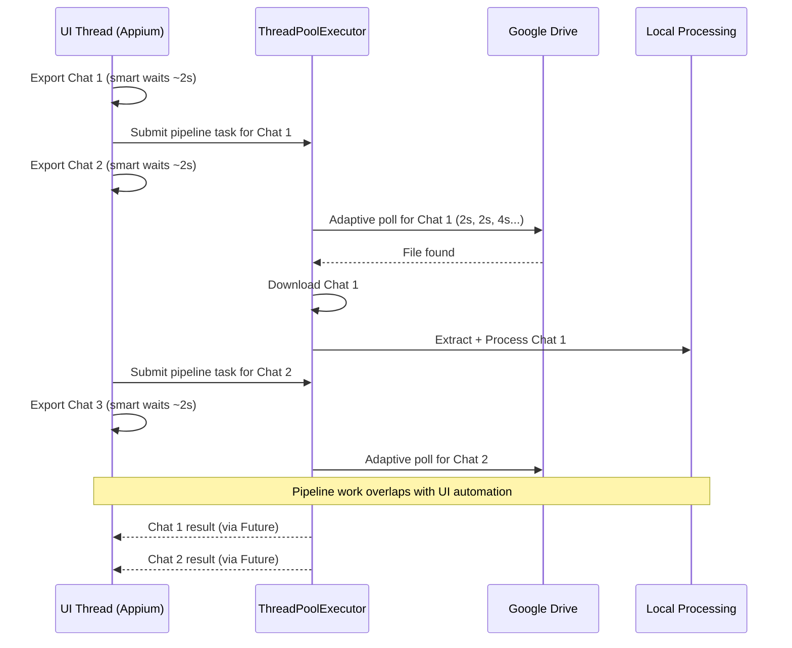

# feat: Optimize export speed with smart waits, adaptive polling, and parallel pipeline

## Overview

Replace hardcoded `time.sleep()` calls in export steps with condition-based waits, replace fixed-interval Drive polling with adaptive backoff, and overlap pipeline processing with UI automation using background threads. Target: 30%+ faster batch exports with no increase in flakiness.

## Problem Frame

A full batch export of ~417 chats takes hours. Per-chat overhead is dominated by:
1. **Hardcoded UI sleeps** (~6.5s/chat, ~45 min total) — unconditional `time.sleep()` even when UI is ready
2. **Sequential Drive polling** (~8-300s/chat) — fixed 8s interval, blocking all other work
3. **Sequential pipeline** — download + extract + process blocks before next chat starts

(see origin: docs/brainstorms/2026-03-28-export-speed-optimization-requirements.md)

## Requirements Trace

- R1. Replace hardcoded `time.sleep()` in step files with condition-based waits
- R2. Smart waits must use timeout profile values as ceilings
- R3. Timeout profile system wired consistently through all steps
- R4. Adaptive Drive polling with progressive backoff (2s → 4s → 8s)
- R5. Auto-detect export mode for appropriate timeout defaults
- R6. Parallel pipeline — background thread handles poll/download/process while UI proceeds
- R7. Background thread isolated from Appium/UI thread
- R8. Background errors captured, not propagated to UI thread
- R9. Configurable concurrency limit (default: 2)
- R10. Per-chat timing breakdown in export summary

## Scope Boundaries

- Drive stays as transfer mechanism — no alternative paths
- Appium/Selenium driver layer and element-finding strategy unchanged
- No new user-facing CLI flags beyond `--format-version` already shipped
- Voice transcription and output formatting untouched
- Retry delays in `base_step.py` (`execute_with_retry`) are intentional and stay

## Context & Research

### Relevant Code and Patterns

**Export step files** (Track 1 targets — all in `whatsapp/export/steps/`):
| Step | File | Sleeps | Category |
|------|------|--------|----------|
| ClickMore | `click_more.py:41` | 0.3s | Pre-find animation |
| ClickExport | `click_export.py:42,87` | 0.3s + 0.5s | Pre-find + post-click |
| SelectMedia | `select_media.py:46,105` | 0.3s + 0.5s | Pre-find + post-click |
| SelectDrive | `select_drive.py:41,49,179,202` | 0.5s + 1.0s + 0.5s + 0.3s | Mixed |
| ClickUpload | `click_upload.py:41,98,150` | 0.5s + 1.0s + 1.0s | Pre-find + confirmation |
| OpenMenu | `open_menu.py` | None | Already uses smart find |

**Drive polling** — `google_drive/drive_client.py:poll_for_new_export()` (line 322). Fixed `time.sleep(poll_interval)` at lines 394, 398, 401.

**Export loop** — `export/chat_exporter.py:export_chats()` (line 1556) and `export_chats_with_new_workflow()` (line 412). Legacy path has inline pipeline at lines 1642-1669.

**Timeout profiles** — `config/timeouts.py` has `TimeoutConfig` with `screen_transition_wait`, `animation_complete_wait`, `step_delay` fields that are currently unused by step files.

**Existing threading** — `ThreadPoolExecutor` in `archive_extractor.py` (2-4 workers), `RLock` in `StateManager`, `ExportQueue`, `CheckpointManager`, `ElementCache`. `EventBus` is thread-safe.

**Pipeline entry** — `pipeline.py:WhatsAppPipeline.process_single_export()` (line 115) — synchronous, safe to run in background thread.

### Institutional Learnings

- Fail-fast per chat — don't add aggressive retry loops (validated by Pocketsmith post-mortem)
- `InvalidSessionIdException` risk during long runs — faster exports reduce exposure
- PageFactory rejected — existing `SelectorRegistry` + `ElementFinder` is the right pattern
- Android emulator can't run concurrently — parallelism must be within pipeline stages, not across devices
- `max_concurrent` field exists in `config/settings.py` (default 3) on a separate settings class, NOT on `PipelineConfig` — add a new `max_concurrent` field to `PipelineConfig` for R9

## Key Technical Decisions

- **`ThreadPoolExecutor` over raw threads**: Already established in `archive_extractor.py`. Provides `Future` objects for error capture (R8), `max_workers` for concurrency limit (R9), and `as_completed` for result collection.
- **Condition-based waits using `element_finder.find()` existing timeout**: The `ElementFinder` already uses `WebDriverWait` internally. Rather than adding new WebDriverWait calls in steps, replace pre-find sleeps by simply removing them (the find call already waits), and replace post-click sleeps by waiting for the next step's target element.
- **Wire `TimeoutConfig` fields through `StepContext`**: Add `timeout_config: TimeoutConfig` to `StepContext` so steps can read `animation_complete_wait`, `screen_transition_wait` etc. as ceiling values. This satisfies R2 and R3 without changing the `BaseExportStep` ABC.
- **Adaptive polling as internal behavior**: The `poll_for_new_export()` method signature stays compatible — `poll_interval` becomes `initial_interval`, backoff is internal. No API breakage.
- **Chat-name-scoped Drive polling**: `poll_for_new_export()` must accept a `chat_name` filter so concurrent polls target specific files. Without this, parallel pipeline tasks could match the wrong chat's export. The current query (`name contains 'WhatsApp Chat with'`) is too broad for concurrent use — add `chat_name` to the query filter.
- **Per-chat timing via dataclass**: A `ChatTiming` dataclass collects ui_time, poll_time, download_time, process_time. Returned alongside results. No new logging framework.
- **Concurrency limit via new `PipelineConfig.max_concurrent` field**: Add `max_concurrent: int = 2` to `PipelineConfig` (the field does not currently exist there — `config/settings.py` has a similar field on a different class with default 3, but we use 2 for conservative concurrency during initial rollout). Config constant, not CLI flag (see origin: scope boundaries).

## Open Questions

### Resolved During Planning

- **Threading model**: `ThreadPoolExecutor` — established pattern in `archive_extractor.py`, provides futures for error capture and `max_workers` for concurrency.
- **UI conditions per step**: Three categories identified — (a) pre-find sleeps: remove entirely since `element_finder.find()` already waits, (b) post-click sleeps: replace with find for next expected element, (c) confirmation sleeps: replace with poll for verification condition.
- **Concurrency limit surface**: New `max_concurrent: int = 2` field on `PipelineConfig`. Not a CLI flag.

### Deferred to Implementation

- Exact timeout ceiling values per step — may need tuning after initial implementation with real device
- Drive upload latency distribution — needs empirical measurement; adaptive polling handles both cases
- **Which export path gets parallel pipeline**: Wire into `export_chats()` first (legacy path with inline pipeline at lines 1642-1669). Check during implementation whether headless mode uses the new workflow path — if so, wire that too. The new workflow path currently has no pipeline integration, so parallel pipeline would need to be added from scratch there.

## High-Level Technical Design

> *This illustrates the intended approach and is directional guidance for review, not implementation specification. The implementing agent should treat it as context, not code to reproduce.*



**Adaptive polling backoff schedule:**
```
Attempt:   1    2    3    4    5    6    7    8   ...
Interval: 2s   2s   4s   4s   8s   8s   8s   8s  ...  (capped at 8s)
```

## Implementation Units

- [x] **Unit 1: Wire TimeoutConfig through StepContext**

**Goal:** Make timeout profile values available to all export steps so they can use them as wait ceilings.

**Requirements:** R2, R3

**Dependencies:** None

**Files:**
- Modify: `whatsapp_chat_autoexport/whatsapp/export/steps/base_step.py` — add `timeout_config` to `StepContext`
- Modify: `whatsapp_chat_autoexport/whatsapp/export/workflow.py` — pass `TimeoutConfig` when constructing context
- Modify: `whatsapp_chat_autoexport/config/timeouts.py` — no changes expected, but verify `get_timeout_config()` is importable
- Test: `tests/unit/test_export_steps.py`

**Approach:**
- Add `timeout_config: TimeoutConfig` field to `StepContext` dataclass with default `get_timeout_config()`
- Update `ExportWorkflow` to pass active config when building context
- Update `create_test_context()` helper in tests to include timeout config

**Patterns to follow:**
- `StepContext` dataclass pattern in `base_step.py`
- `get_timeout_config()` singleton pattern in `config/timeouts.py`

**Test scenarios:**
- Happy path: StepContext created with default TimeoutConfig has NORMAL profile values
- Happy path: StepContext created with explicit FAST profile has reduced values
- Edge case: StepContext without explicit timeout_config falls back to global default

**Verification:**
- All existing step tests pass with the new field
- Steps can access `self.context.timeout_config.animation_complete_wait` etc.

---

- [x] **Unit 2: Replace hardcoded sleeps with smart waits in export steps**

**Goal:** Remove all `time.sleep()` calls from step files and replace with condition-based waits.

**Requirements:** R1, R2, R3

**Dependencies:** Unit 1

**Files:**
- Modify: `whatsapp_chat_autoexport/whatsapp/export/steps/click_more.py`
- Modify: `whatsapp_chat_autoexport/whatsapp/export/steps/click_export.py`
- Modify: `whatsapp_chat_autoexport/whatsapp/export/steps/select_media.py`
- Modify: `whatsapp_chat_autoexport/whatsapp/export/steps/select_drive.py`
- Modify: `whatsapp_chat_autoexport/whatsapp/export/steps/click_upload.py`
- Test: `tests/unit/test_export_steps.py`

**Approach:**
- **Pre-find animation waits** (0.3s): Remove entirely. The subsequent `element_finder.find()` already uses WebDriverWait and will return as soon as element is present.
- **Post-click transition waits** (0.5-1.0s): Replace with a find call for the element expected in the next state (e.g., after clicking "Export chat", wait for the media selection dialog element). Use `timeout_config.screen_transition_wait` as ceiling.
- **Confirmation waits** (1.0s in click_upload): Replace with a polling check for the upload verification condition (`_verify_upload_started()`). Use `timeout_config.step_delay` as ceiling.
- Keep retry delays in `base_step.py:execute_with_retry()` — these are intentional backoff, not animation waits.

**Execution note:** Add characterization tests for each step's current behavior before modifying, to catch regressions.

**Patterns to follow:**
- `OpenMenuStep` — already uses no sleeps, just `element_finder.find()` with timeout
- `ElementFinder.find()` pattern with configurable timeout

**Test scenarios:**
- Happy path: ClickMoreStep completes without sleep when element is immediately available
- Happy path: ClickExportStep waits for export dialog element instead of sleeping 0.5s
- Happy path: SelectDriveStep waits for Drive picker element instead of sleeping 1.0s
- Happy path: ClickUploadStep polls for upload started condition instead of sleeping 1.0s
- Edge case: Element not found within timeout ceiling — step fails with clear error, not infinite hang
- Edge case: FAST profile uses shorter ceiling than NORMAL profile
- Error path: Element appears then disappears (stale element) — step handles gracefully
- Integration: Full ExportWorkflow completes faster with FAST profile than with equivalent hardcoded sleeps

**Verification:**
- No `time.sleep()` calls remain in any step file (except retry delays in base_step.py)
- All step tests pass with mocked element finder
- Workflow integration test confirms steps use timeout_config values

---

- [x] **Unit 3: Implement adaptive Drive polling**

**Goal:** Replace fixed 8s polling interval with progressive backoff starting at 2s.

**Requirements:** R4, R5

**Dependencies:** None (can be done in parallel with Units 1-2)

**Files:**
- Modify: `whatsapp_chat_autoexport/google_drive/drive_client.py` — `poll_for_new_export()` method
- Modify: `whatsapp_chat_autoexport/google_drive/drive_manager.py` — `wait_for_new_export()` must pass through new params (chat_name filter, adaptive interval)
- Modify: `whatsapp_chat_autoexport/pipeline.py` — `PipelineConfig` field rename/update, add `max_concurrent: int = 2`
- Test: `tests/unit/test_drive_polling.py` (new file)

**Approach:**
- Change `poll_for_new_export()` internal loop: start at `initial_interval` (default 2s), double after every 2 polls, cap at `max_interval` (default 8s)
- Add `chat_name: Optional[str] = None` parameter — when provided, append to Drive API query filter so concurrent polls target specific exports (critical for parallel pipeline safety)
- Add `include_media: bool = False` parameter — when False, default timeout drops from 300s to 120s (R5)
- Keep method signature backward-compatible: `poll_interval` parameter becomes `initial_interval` with default 2, add `max_interval` with default 8
- Update `DriveManager.wait_for_new_export()` to pass through new params (chat_name, initial_interval, max_interval) — this is the layer `process_single_export()` actually calls
- Update `PipelineConfig` to pass through the new parameters and add `max_concurrent: int = 2`

**Patterns to follow:**
- Existing `poll_for_new_export()` structure — keep the same error handling for HTTP errors and general exceptions

**Test scenarios:**
- Happy path: File found on first poll (2s interval) — returns immediately
- Happy path: File found on 5th poll — intervals were 2, 2, 4, 4 seconds
- Happy path: File not found — intervals cap at max_interval, timeout at configured limit
- Happy path: include_media=False uses 120s timeout; include_media=True uses 300s
- Edge case: File appears during backoff — detected at next poll, not missed
- Error path: HTTP error during poll — retries with same backoff, doesn't reset interval
- Error path: Timeout reached — returns None with clear log message
- Integration: Two concurrent polls with different chat_name filters — each finds only its own export file, not the other's

**Verification:**
- Polling intervals follow backoff schedule (testable by mocking time.sleep and asserting call args)
- Default behavior for callers who don't pass new params is faster (2s start vs 8s)

---

- [x] **Unit 4: Add ChatTiming dataclass and per-chat timing instrumentation**

**Goal:** Capture per-chat timing breakdown for observability.

**Requirements:** R10

**Dependencies:** None (can be done in parallel with other units)

**Files:**
- Create: `whatsapp_chat_autoexport/export/timing.py`
- Modify: `whatsapp_chat_autoexport/export/chat_exporter.py` — instrument the export loop
- Test: `tests/unit/test_timing.py` (new file)

**Approach:**
- `ChatTiming` dataclass with fields: `chat_name`, `ui_time_s`, `poll_time_s`, `download_time_s`, `process_time_s`, `total_time_s`, `status` (success/failed/skipped)
- Context manager or simple start/stop timing helper
- Instrument the per-chat loop in `export_chats()` to capture each phase
- Return `list[ChatTiming]` alongside existing results
- Print timing summary table at end of export (using existing logger)

**Patterns to follow:**
- Existing `timings` dict in `export_chats()` return value — extend or replace with structured data
- `rich` library already in dependencies for table formatting

**Test scenarios:**
- Happy path: ChatTiming captures all four phases with non-zero durations
- Happy path: Timing summary includes total across all chats
- Edge case: Chat fails during poll phase — timing records phases completed, marks status=failed
- Edge case: Chat skipped (resume mode) — timing records zero for all phases, status=skipped

**Verification:**
- Timing data is available in return value of `export_chats()`
- Summary table printed to logger at end of batch

---

- [x] **Unit 5: Implement parallel pipeline with ThreadPoolExecutor**

**Goal:** Run Drive polling + download + processing in background threads while UI automation continues.

**Requirements:** R6, R7, R8, R9

**Dependencies:** Unit 3 (adaptive polling), Unit 4 (timing)

**Files:**
- Create: `whatsapp_chat_autoexport/export/parallel_pipeline.py`
- Modify: `whatsapp_chat_autoexport/export/chat_exporter.py` — wire parallel pipeline into export loop
- Modify: `whatsapp_chat_autoexport/pipeline.py` — wire `max_concurrent` field
- Test: `tests/unit/test_parallel_pipeline.py` (new file)
- Test: `tests/integration/test_parallel_export.py` (new file)

**Approach:**
- New `ParallelPipeline` class wrapping `ThreadPoolExecutor(max_workers=config.max_concurrent)`
- `submit(chat_name, ...)` returns a `Future` — queues the pipeline task (poll + download + extract + process)
- `collect_results()` calls `as_completed()` on all futures, captures results and errors
- `shutdown()` for clean teardown
- In `export_chats()`: after Appium export triggers upload, submit to `ParallelPipeline` instead of calling `process_single_export()` synchronously. Continue to next chat immediately.
- After all chats exported, call `collect_results()` to gather all pipeline outcomes
- Error isolation (R8): each `Future` catches all exceptions internally, returns error result. Main thread never sees uncaught exceptions from pool.
- Thread safety (R7): `ParallelPipeline` owns no shared mutable state. Each task gets its own `chat_name` and config. Results collected via `Future` objects. Logger is thread-safe. State managers use `RLock`.

**Patterns to follow:**
- `ThreadPoolExecutor` + `as_completed` pattern from `archive_extractor.py`
- `RLock` guard pattern from `StateManager`, `ExportQueue`

**Test scenarios:**
- Happy path: 3 chats submitted, all complete successfully, results collected in order
- Happy path: Pipeline tasks run concurrently (mock processing with short sleep, verify wall-clock time < sequential)
- Happy path: max_workers=2 enforced — 3 tasks submitted, only 2 run simultaneously
- Edge case: Pipeline task fails — error captured in Future, other tasks unaffected
- Edge case: UI thread submits faster than pipeline completes — tasks queue up, don't block UI
- Error path: Download fails for one chat — error result returned, other chats processed normally
- Error path: Exception in processing — captured by Future, not propagated to main thread
- Error path: shutdown() called while tasks in-flight — tasks complete before shutdown returns
- Error path: Early batch abort (session error) while futures in-flight — shutdown() collects completed results, cancels pending, does not hang
- Integration: Full export with mocked Appium + mocked Drive — verify overlap timing (UI for chat N+1 starts before pipeline for chat N completes)

**Verification:**
- Batch export with parallel pipeline is measurably faster than sequential (mock test)
- No errors leak from pool to main thread
- `collect_results()` returns complete result set for all submitted chats

---

- [x] **Unit 6: End-to-end integration and timing validation**

**Goal:** Validate all three tracks work together and measure actual speedup.

**Requirements:** All (R1-R10)

**Dependencies:** Units 1-5

**Files:**
- Modify: `tests/integration/test_parallel_export.py` — add full-flow test
- No production code changes expected

**Approach:**
- Integration test with mocked Appium driver and mocked Drive API
- Simulate 5-chat batch export with configurable delays
- Assert: wall-clock time significantly less than sequential sum
- Assert: timing breakdown captured for all chats
- Assert: no errors from parallel execution
- Assert: results match expected (all chats exported and processed)

**Test scenarios:**
- Happy path: 5-chat batch with mocked 1s UI + 3s polling + 1s processing — parallel should complete in ~8-10s vs ~25s sequential
- Edge case: One chat fails mid-pipeline — other 4 succeed, failed chat has error in timing report
- Edge case: All chats fail pipeline — UI automation still completes all 5, error report shows all failures

**Verification:**
- Integration test demonstrates measurable speedup
- Timing report is complete and accurate
- Error isolation confirmed under parallel execution

## System-Wide Impact

- **Interaction graph:** `ChatExporter.export_chats()` is called from `headless.py:run_headless()` and from the TUI. The parallel pipeline changes the return timing but not the API contract. TUI integration uses `asyncio.to_thread()` for blocking export — the parallel pipeline runs inside that thread, which is safe.
- **Error propagation:** Pipeline errors are captured per-future and surfaced in the results summary. The existing `results` dict (chat_name -> bool) API is preserved. New `ChatTiming` data is additive.
- **State lifecycle risks:** `StateManager` and `CheckpointManager` use `RLock` — safe for concurrent access. Each pipeline task operates on a different chat, so no contention on same-chat state.
- **API surface parity:** `export_chats()` return value gains `timings` data but existing return structure preserved. No CLI flag changes.
- **Integration coverage:** Unit tests with mocks validate isolation; integration test with mocked driver validates end-to-end flow. Real-device testing deferred to manual validation.
- **Unchanged invariants:** `BaseExportStep` ABC interface unchanged. `StepResult` return type unchanged. `ExportWorkflow.execute()` step ordering unchanged. `GoogleDriveClient` API backward-compatible. Pipeline `process_single_export()` signature unchanged.

## Risks & Dependencies

| Risk | Mitigation |
|------|------------|
| Smart waits too aggressive — flaky on slow devices | Timeout ceilings from TimeoutConfig; SLOW profile available for degraded devices |
| WhatsApp throttles rapid successive exports | Monitor in first real batch; add configurable between-chat delay if needed |
| Drive API rate limit at 2s polling | Single user, well below quota. Backoff to 8s reduces sustained rate. |
| Thread safety issue in pipeline | Pipeline tasks are isolated (own chat_name, own state). StateManager/Queue already use RLock. |
| `export_chats_with_new_workflow()` not wired for parallel | Wire `export_chats()` first; check during implementation if headless uses new workflow path and wire that too if needed |
| Concurrent Drive polls match wrong chat's export | Add chat_name filter to `poll_for_new_export()` query — concurrent polls scoped to specific files |

## Sources & References

- **Origin document:** [docs/brainstorms/2026-03-28-export-speed-optimization-requirements.md](docs/brainstorms/2026-03-28-export-speed-optimization-requirements.md)
- Timeout profiles: `whatsapp_chat_autoexport/config/timeouts.py`
- Export steps: `whatsapp_chat_autoexport/whatsapp/export/steps/`
- Drive polling: `whatsapp_chat_autoexport/google_drive/drive_client.py:322`
- Export loop: `whatsapp_chat_autoexport/export/chat_exporter.py:1556`
- ThreadPoolExecutor pattern: `whatsapp_chat_autoexport/processing/archive_extractor.py`
- Thread-safe state: `whatsapp_chat_autoexport/state/state_manager.py`
